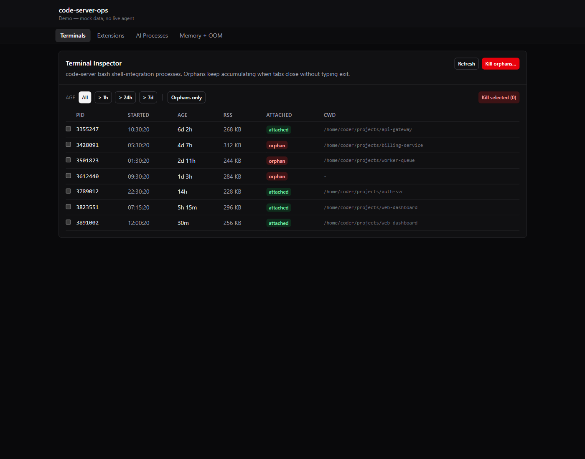
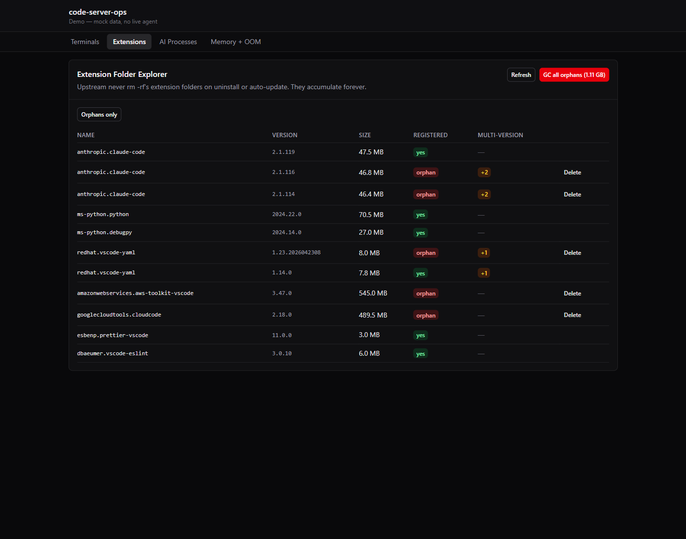
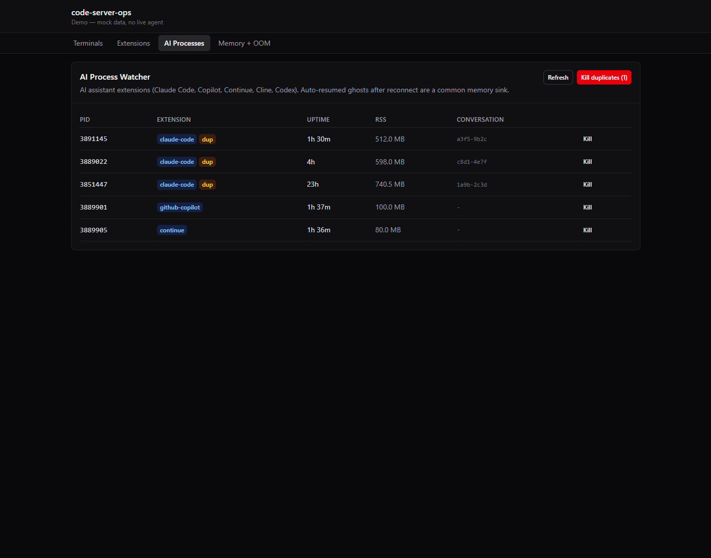
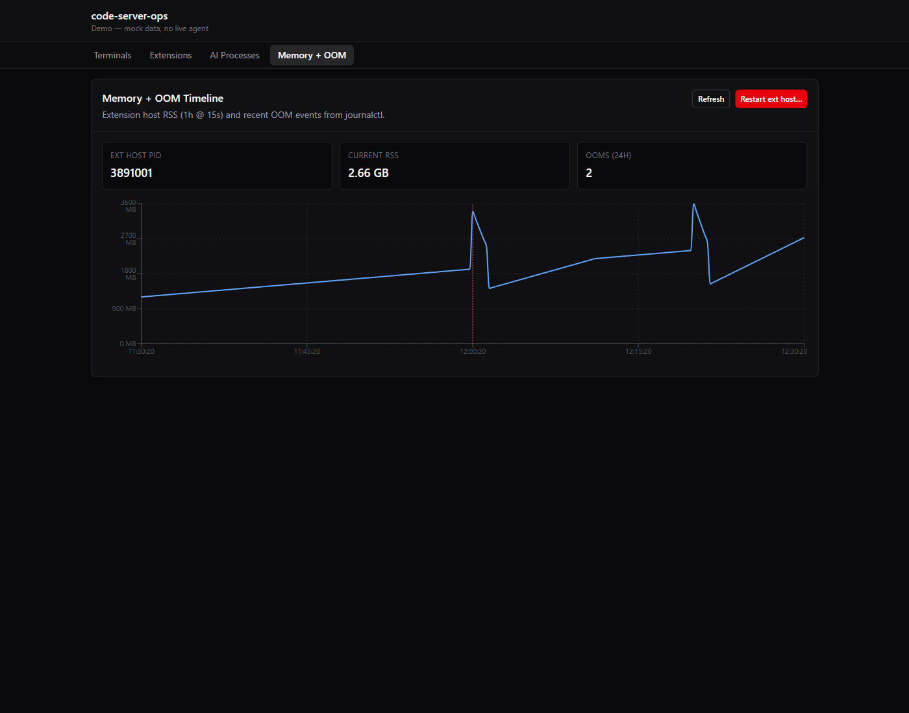

# code-server-ops

Admin dashboard + agent for self-hosted [code-server](https://github.com/coder/code-server). Fills the "won't fix" gap upstream left.

> **Status:** `v0.1.0` — stable. Three npm packages (agent + CLI + React UI) and a multi-arch Docker image on `ghcr.io`.

## Screenshots

Four dashboards. Every destructive action is gated by a Preview-before-commit flow.

| | |
|---|---|
| **Terminal Inspector** — orphan bash processes left behind when code-server tabs close without `exit`. Per-row kill or bulk "kill orphans older than [age]" with a Preview modal listing the exact PIDs. |  |
| **Extension Folder Explorer** — folders on disk vs. `extensions.json` registry. Orphan badges for uninstalled-but-not-deleted folders. Multi-version peers (e.g. three old claude-code versions surviving an auto-update). "GC all orphans" shows reclaimable bytes (here: 1.11 GB across 5 folders). |  |
| **AI Process Watcher** — Claude Code, Copilot, Continue, Cline, Codex processes. Highlights duplicates that accumulate from auto-resumed sessions. "Kill duplicates" keeps the oldest panel (your active conversation) and SIGTERMs the ghosts. |  |
| **Memory + OOM Timeline** — extension-host RSS over the last hour at 15-second resolution. Dotted red vertical markers at OOM-kill events parsed from `journalctl`. "Restart ext host" SIGTERMs the extension host surgically so code-server respawns it without losing your tabs. |  |

## Why this exists

If you self-host code-server for a single user (not a team), you hit operational failure modes upstream refuses to fix:

- **Orphan bash terminals accumulate across tab closes.** Closed as "use tmux/screen": [coder/code-server#6291](https://github.com/coder/code-server/issues/6291), [#7228](https://github.com/coder/code-server/issues/7228).
- **Extension folders are never deleted.** Uninstall updates `extensions.json` but leaves the directory. Auto-update registers new versions without removing old ones. Closed `not_planned`: [vscode#213844](https://github.com/microsoft/vscode/issues/213844), [vscode#78107](https://github.com/microsoft/vscode/issues/78107).
- **Extension host V8 heap runs out with AI-assistant extensions.** Still open and chronic: [vscode#294050](https://github.com/microsoft/vscode/issues/294050), [vscode#309016](https://github.com/microsoft/vscode/issues/309016), [vscode#266716](https://github.com/microsoft/vscode/issues/266716).

Coder Enterprise addresses some of this — for team workspaces managed via Terraform + k8s. For single-tenant self-hosters there is no admin panel. That is the gap this project fills.

## What's in the box (v0.0.2-alpha.1)

| Package | What it does |
|---|---|
| [`code-server-ops-agent`](https://www.npmjs.com/package/code-server-ops-agent) | Fastify service. Read endpoints (`/terminals`, `/extensions`, `/ai-processes`, `/memory`, `/oom-events`, `/metrics`) + mutation endpoints with a Preview→Confirm token pattern. Serves the bundled UI at `/`. |
| [`code-server-ops-cli`](https://www.npmjs.com/package/code-server-ops-cli) | `csops` — commander-based terminal client. `terminals list/kill/kill-orphans`, `extensions list/gc`, `memory show/watch/restart-ext-host`. Cron-friendly with `--json`. |
| [`code-server-ops-ui`](https://www.npmjs.com/package/code-server-ops-ui) | React 19 + Tailwind v4 + shadcn component library (`v0.0.3-alpha.1`). Four dashboards: Terminal Inspector, Extension Folder Explorer, AI Process Watcher, Memory + OOM Timeline. Also publishes a standalone SPA. Configurable base URL so it can be embedded behind a proxy. |

## Four dashboards

- **Terminal Inspector** — one row per shell-integration bash. Per-row kill + bulk "kill orphans older than [age]" with a Preview modal listing the exact PIDs before you commit.
- **Extension Folder Explorer** — disk folders vs `extensions.json` registry. Orphan badge + multi-version badge. "GC all orphans" shows reclaimable bytes before deleting.
- **AI Process Watcher** — Claude Code, Copilot, Continue, Cline, Codex. Flags duplicates from auto-resumed sessions, kills them with one click.
- **Memory + OOM Timeline** — 1h extension-host RSS chart with OOM events from `journalctl` overlaid as red markers. "Restart ext host" button SIGTERMs the extension host surgically — code-server respawns it without losing your tabs.

All destructive actions use a two-step Preview→Confirm flow: the UI fetches a preview (listing what's about to change), then commits with a short-lived confirmation token. Stale-tab drive-bys are rejected on the server.

## Install

### Sidecar (recommended)

```yaml
services:
  code-server-ops-agent:
    image: ghcr.io/barrymister/code-server-ops:0.0.2-alpha.1   # docker image lands session 97
    pid: "container:code-server"
    network_mode: "service:code-server"
    volumes:
      - /var/log/journal:/var/log/journal:ro
      - code-server-extensions:/home/coder/.local/share/code-server/extensions
    environment:
      - CSOPS_PASSWORD=${CSOPS_PASSWORD}
```

The UI is served from `http://<host>:4242/`. Open that URL, enter your `CSOPS_PASSWORD`, and the four dashboards appear. See [docs/INSTALL.md](./docs/INSTALL.md) for the full recipe and the `CAP_SYS_PTRACE` non-root hardening path.

### CLI only (no UI)

```bash
npm install -g code-server-ops-cli
export CSOPS_URL=http://code-server-host:4242
export CSOPS_PASSWORD=your-password

csops terminals list --orphan-only --older-than 24h
csops terminals kill-orphans --older-than 24h --yes
csops extensions gc --yes
csops memory watch
```

### Embed the UI in your own admin panel

```tsx
"use client";
import { Dashboard } from "code-server-ops-ui";
import "code-server-ops-ui/styles.css";

// Point the library at a server-side proxy route so the agent password
// stays off the browser. The host app's own auth (session cookies, etc.)
// protects the proxy.
export default function CodeServerOps() {
  return (
    <Dashboard
      skipAuth
      baseUrl="/api/infrastructure/code-server"
      title="code-server ops"
    />
  );
}
```

Individual panels (`TerminalsPanel`, `ExtensionsPanel`, `AiProcessesPanel`, `MemoryTimelinePanel`) export separately if you want your own layout. Reference integration lives in [growth-engine](https://gitea.barrymister.dev/barrymister/growth-engine)'s `/infrastructure/code-server` page.

## Architecture

See [docs/ARCHITECTURE.md](./docs/ARCHITECTURE.md) for the sidecar topology diagram and component responsibilities.

## License

MIT. See [LICENSE](./LICENSE).
